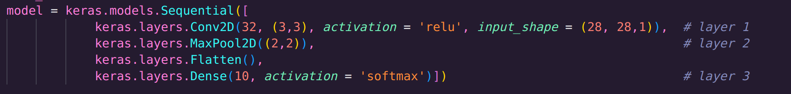
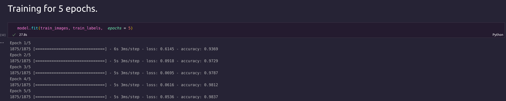
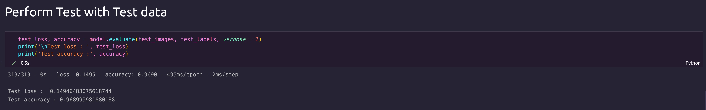
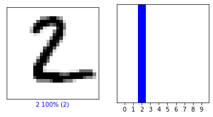
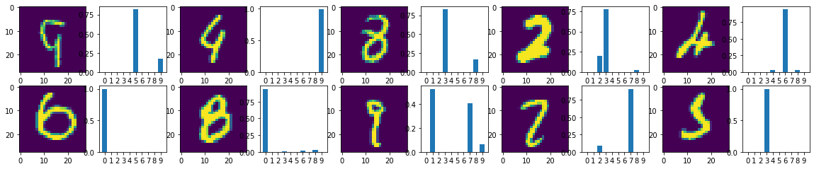
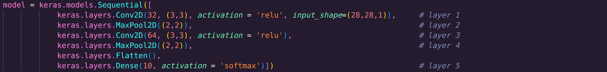
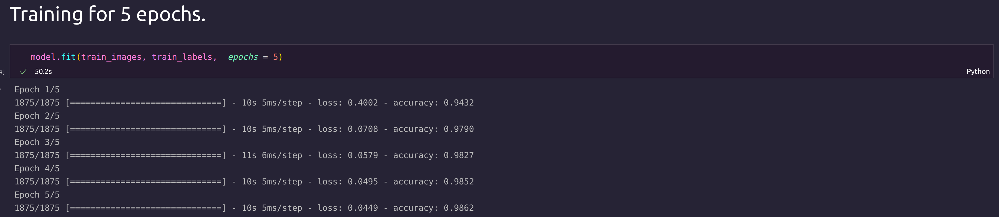
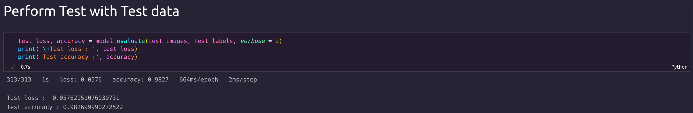
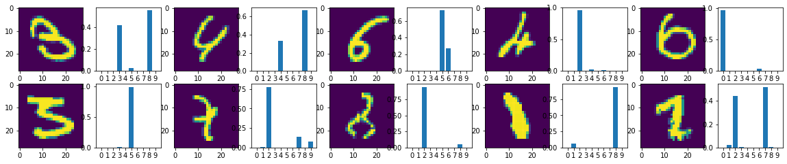

#### 1. MODEL 1 : 3 Layers with 1 Convolution layer

#### 2. Training with Training loss 

#### 3. Test Accuracy

#### 4. Images and corresponding probability that predicted Right 

#### 5. Images and corresponding probability that predicted Wrong

#### --------------------------------------------------- ####

#### 1. MODEL 2 : 5 Layers with 2 Convolution layer 

#### 2. Training with Training loss 

#### 3. Test Accuracy

#### 4. Images and corresponding probability that predicted Right 

#### 5. Images and corresponding probability that predicted Wrong

#### --------------------------------------------------- ####

#### 1. MODEL 3 : 7 Layers with 4 Convolution layer 

#### 2. Training with Training loss 

#### 3. Test Accuracy

#### 4. Images and corresponding probability that predicted Right 

#### 5. Images and corresponding probability that predicted Wrong

