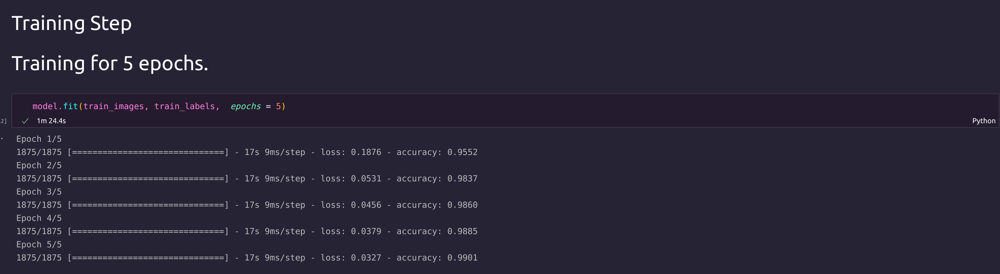
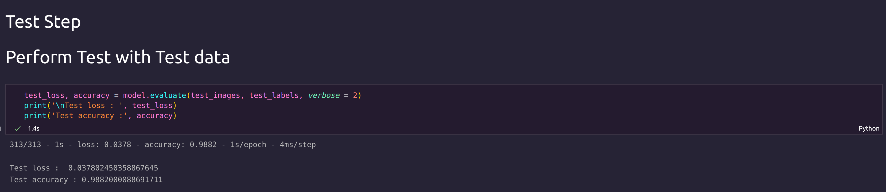
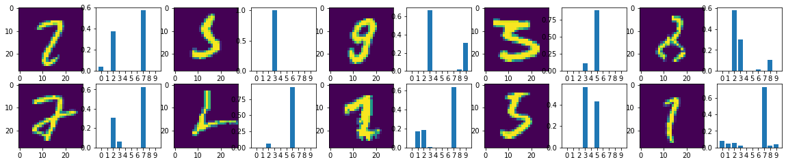

#### 1. Model 

#### 2. Training with Training loss 

#### 3. Test Accuracy

#### 4. Images and corresponding probability that predicted Right 

#### 5. Images and corresponding probability that predicted Wrong

